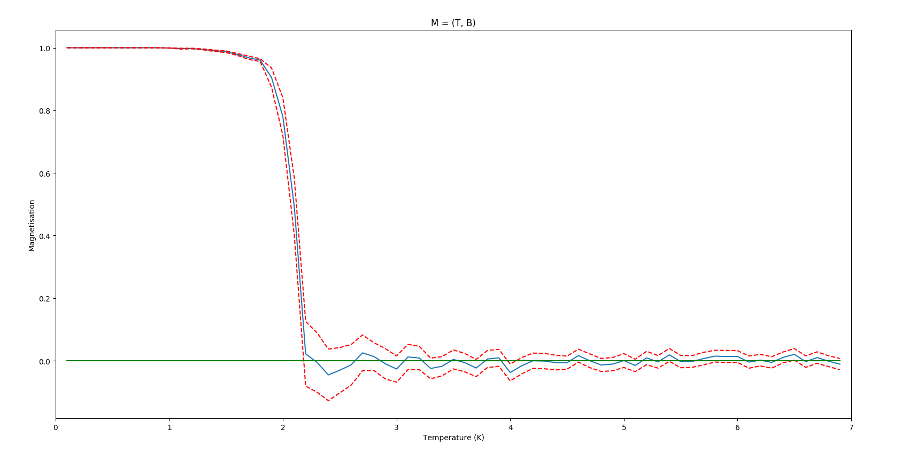

# IsingModel

In the physics university context, this project is on the study of the 2D Ising model (two-dimensional square-lattice).  
This project uses **Monte Carlo simulation** to allows the identification of magnetic phase transitions, as a simplified model of reality.  

To exect the project, you need to generate the build with ./regen_build.sh  
To exect the test, go to /built and make check  

**A typical result**  

This simulation is for B = 0, with 200 Monte Carlo simulations and 500 Hastings iterations. We draw the 95% confidence intervalle with red lines. We can see the Curie temperature is approximately 2,3 K.

This project uses [lava/matplotlib-cpp](https://github.com/lava/matplotlib-cpp) to plot graphics. That is why, Python needs to be installed.
